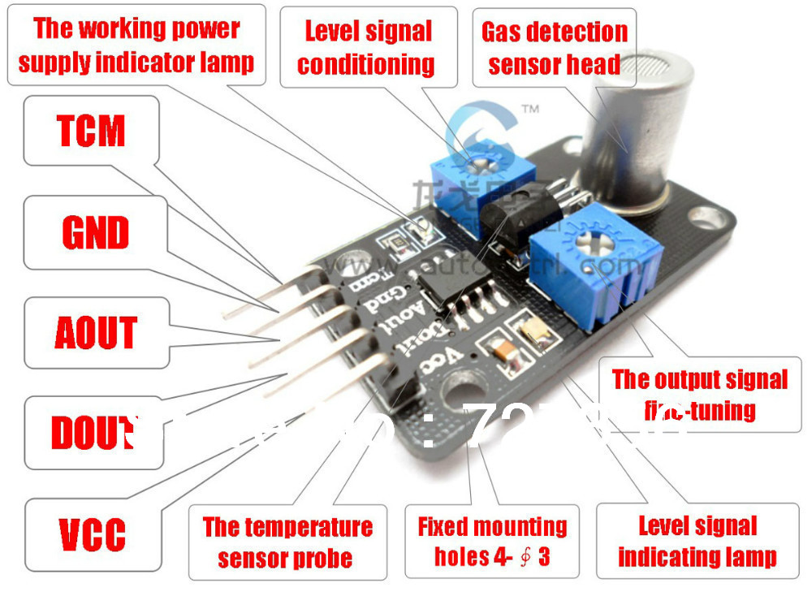
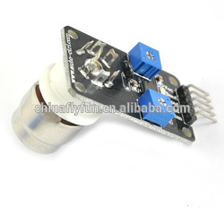
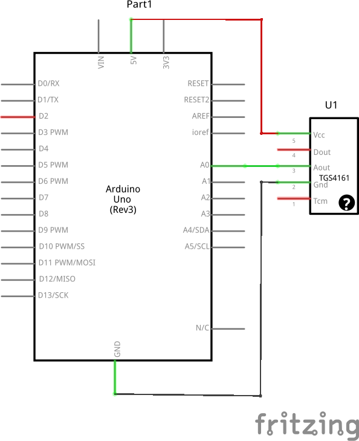
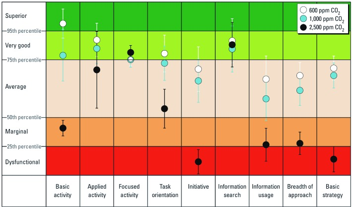

# Overview

Library allows to read and calibrate modules based on CO2 sensor.

## TGS4161

 

## MG811

 

# Pinout

 * `VCC` - stabilized voltage (5V for TGS4166 and 6V for MG811)
 * `GND` - ground
 * `AOUT` - link to an analog input of Arduino.
 * `DOUT` - digital value indicates whether current concentration exceeds some thretshold value (can be adjusted by potentiometer)
 * `TCM `- temperature compensation (I have no details)

 

 [Module wiring in Fritzing](schemes/tgs4161.fzz)

# Calibration Theory

## General information

Before calibration it is necessary to refresh the room. Then we treat concentration of co2 as 400 ppm.

## Concentration calculation

Sensor provides a value (voltage between 0 and 5 V) which we need to convert to a concentration value by formula:

`c=d^((a-v)/b)`

where

 * `c` - co2 concentration in `ppm`
 * `d` - some constant. 400 in our case.
 * `v` - input from `AOUT` in `millivolts`
 * `a` - a parameter which we'll change during calibration. (Initially 1500)
 * `b` - a constant. 600 in our case

## Software calibration

In order to calibrate we should modify `a` value using this formula

`a := v + b*(Ln(c1)/Ln(d))`

where

c1 - is the current real concentration value. For example for well refreshed room it will be 400 ppm.

Actually we always take `d = c1` in such case our calculation will be simpler and we do not need calculate Ln. Then actual adjustment formula is just

`a := v + b`

If we decide to change `c1` then we should change `b` and `d` constants using such formulas

 * `d := c1`
 * `b := 100*Ln(c1)`

## Hardware calibration

The module contains 2 potentiometers.

 * Left - adjusts threshold of DOUT
 * Rigth - hardware sensor calibration

# Usage

Class constructor accepts one parameter - analog input of arduino. Specify the number of analog input linked to `AOUT` of the module (`A0`, `A1`, `A2` etc)

The example of arduino sketch is [here](examples/ReadCO2/ReadCO2.ino).

# CO2 concentration impact on humans

 

From [here](http://www.vox.com/2014/8/6/5971187/carbon-dioxide-indoors-air-pollution)
